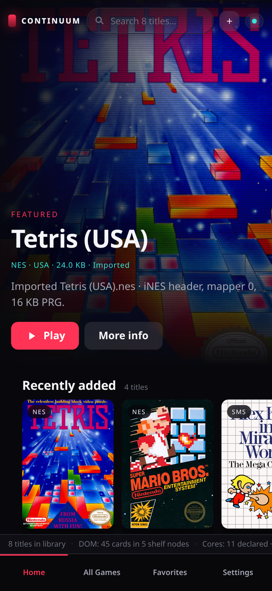
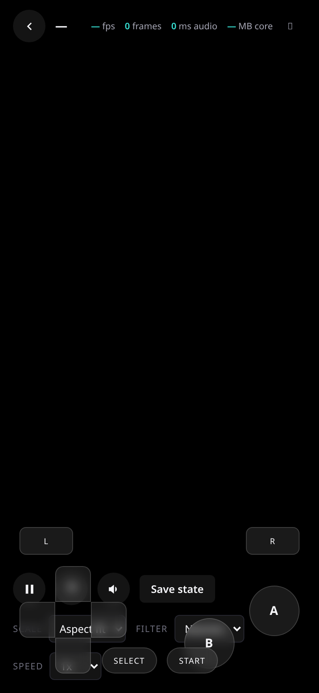
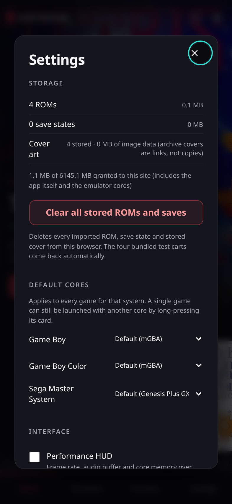

# Continuum

Continuum is one app for your iPhone that plays games from lots of old consoles.

It ships as a single file called `Continuum.ipa`. You build that file in the cloud, download it
to your phone, and install it yourself, outside the App Store. That file is the whole product.
There is no website version and no App Store listing.

Inside the app are five "cores". A core is the piece of software that emulates one console
family. Five cores cover nine systems today.

## What it plays right now

| Console | Files it takes | Core doing the work |
| --- | --- | --- |
| NES | `.nes` | fceumm |
| SNES | `.sfc`, `.smc` | snes9x |
| Game Boy, Game Boy Color, Game Boy Advance | `.gb`, `.gbc`, `.gba` | mgba |
| Genesis / Mega Drive, Master System, Game Gear | `.md`, `.gen`, `.sms`, `.gg` | genesis_plus_gx |
| PlayStation 1 | `.cue`, `.chd`, `.pbp`, `.iso` | pcsx_rearmed |

`.bin` files can also be imported, but you never tap a `.bin` to play it. A PlayStation `.cue`
file is a small text file that lists the `.bin` track files sitting next to it, so those `.bin`
files have to be in the app for the `.cue` to load.

## Where it actually stands

**The app plays real games on a real iPhone.** On an iPhone 17 Pro Max, five cores each ran a
real commercial game at 60 fps with 0 dropped frames. A sixth core, the Nintendo DS, has since
been added and has not been run on a device yet, so the `cores:` line now reads **6 of 6
declared** and these seven systems are the confirmed ones:

| System | Game that ran | Core | Frames counted in the screenshot |
| --- | --- | --- | --- |
| NES | Kart Fighter | fceumm | 285 |
| SNES | Super Mario World (U) | snes9x | 466 |
| Game Boy Advance | Pokemon Emerald (USA, Europe) | mgba | 321 |
| Game Boy Color | Pokemon Yellow (UE) | mgba | 1162 |
| Genesis / Mega Drive | Mortal Kombat 3 (USA) | genesis_plus_gx | 2354 |
| Game Gear | Simpsons: Krusty's Fun House (U) | genesis_plus_gx | 2188 |
| PlayStation 1 | Crash Bandicoot (USA) | pcsx_rearmed | 2390 |

Also confirmed on the phone:

- Importing several games at once. One batch of five files reported `imported 5 of 5`.
- Importing a PlayStation game as a `.cue` plus its `.bin` track together in a single go, and
  the game boots.
- PlayStation running with no BIOS file present, using the core's own stand-in for it
  (`BIOS (pcsx_rearmed): none, HLE fallback`).
- The Library counting honestly: `library: 6 game(s) of 7 file(s) in Documents`. The seventh
  file is Crash Bandicoot's `.bin` track. It is on disk, and it is deliberately not a row you
  can tap, because the `.cue` next to it is the thing you play.
- A `.cue` row showing the size of the whole game rather than of the small text file. Crash
  Bandicoot reads `CUE · 602.8 MB · pcsx_rearmed`.
- Roughly 6.8 GB of memory available to the app, with the drawing path holding 60 fps.

**The honest edges:**

- Two file types have never been tried, for want of the files: Master System (`.sms`) and plain
  Game Boy (`.gb`). Each one runs on a core that is already proven by a different file type,
  `.sms` on the core proven by `.md` and `.gg`, and `.gb` on the core proven by `.gba` and
  `.gbc`. So all five cores are confirmed, seven of the nine systems are confirmed directly, and
  those last two are expected to work but nobody has watched them.
- This is a sideloaded developer build, not a polished product. It is a plain list of games on a
  black background with a block of diagnostic text above it. The look further down this page is
  the design target, not what is built.

[TESTING.md](TESTING.md) is the checklist that got it this far. It records which tests have
already passed, so it now doubles as the way to check that a new build has not broken something
that used to work.

The pictures further down came from the older browser prototype, not from the iPhone app. They
are in here to show what the design is aiming at, not to show the iPhone app working.

## How to get the app onto your phone

There is no Mac in this project. GitHub builds the app for you.

1. Open this repository on GitHub and go to the **Actions** tab.
2. In the list on the left, pick the workflow called **iOS**.
3. Press **Run workflow**.
4. Wait for the run to finish and go green. It compiles five emulator cores, so it is not quick.
5. Open the finished run and scroll to **Artifacts**.
6. Download the artifact named `Continuum-ipa-<commit>`, where `<commit>` is the short code for
   the version that was built.
7. That download is a zip. Inside it is `Continuum.ipa`.
8. Install `Continuum.ipa` with whichever sideloading tool you use. Sideloading just means
   installing an app that did not come from the App Store.

Most recent green build: run `35523953475`, artifact `Continuum-ipa-783e575`, about 5.16 MB.

### One thing to know about installers

The `.ipa` is signed with two special permissions:

- **JIT**, which lets the emulator translate game code as it runs. This is what makes the
  heavier consoles fast enough to be playable.
- **A raised memory limit**, about 6.8 GB instead of the few hundred MB an app normally gets.

Installers differ in whether they keep those permissions. TrollStore keeps them. Tools that
re-sign the app before installing it usually strip them out. The app should still install and
run either way, just with less headroom, which will matter later for the bigger consoles rather
than for the ones shipping today. If something goes wrong, tell me which installer you used, as
that changes what the likely cause is.

## How to add games

1. Open the app.
2. Tap **Import Games**.
3. Pick one or more game files.
4. **For a PlayStation game, select the `.cue` and every one of its `.bin` files in the same
   go.** In the file picker that means: tap **Select**, tap each file, then tap **Open**. If you
   import the `.cue` on its own the game cannot load, because the `.cue` only points at tracks
   that are not there.
5. The app copies the files into its own storage, so you can move or delete the originals
   afterwards.
6. Tap a game in the list to play it.

There is a second way in. The app's folder shows up in the iPhone **Files** app, under
**On My iPhone > Continuum**. Anything you drop in there appears in the app's list too, with no
importing needed.

## What it will look like

The browser prototype's look is the agreed design target for the iPhone app: a dark,
Netflix-style library with one big featured game at the top, rows of cover art with a small
system badge on each, and a tab bar along the bottom for Home, All Games, Favorites and
Settings.

| Library | Playing | Settings |
| --- | --- | --- |
|  |  |  |

*All three images are the browser prototype, not the iPhone app.*

**The iPhone app does not look like this yet.** Right now it is a plain list of your games on a
black background, with a block of small diagnostic text above it. That text is there on purpose:
on an app installed this way there is no other way to see what went wrong. [TESTING.md](TESTING.md)
explains how to read it.

These four pictures are also from the browser prototype. They show four of the cores drawing
their own test cartridges, from back when the browser build was the only place any of this ran.

| NES | Game Boy Advance | Master System | SNES |
| --- | --- | --- | --- |
|  |  |  |  |

## What is coming next

More consoles, roughly easiest first:

1. **Nintendo 64**
2. **PSP**
3. **Nintendo DS**
4. **Nintendo 3DS**
5. **Switch**

None of these are built yet. The last two in particular are a long way off. There is a piece of
groundwork for Switch in `native/switch-wrapper/`, and its own tests pass, but there is no Switch
emulator behind it, so it does not play anything.

## What needs testing

"Does emulation work at all" is answered, so what is left is narrower:

- **The two file types nobody has tried:** a Master System `.sms` and a plain Game Boy `.gb`.
  Both run on cores that already work, so this is a short confirmation rather than an open
  question.
- **Bugs in what already works.** Longer sessions, games fussier than the ones tried so far,
  other PlayStation discs, and anything that looks or sounds wrong on screen.

Two pages track all of this, and they are kept current rather than written once:

- **[STATUS.md](STATUS.md)** is what is finished and what is not. One row per system and per
  feature, with three states: done and confirmed on a device, built but never tried, or partial
  with the missing piece named. Nothing in it is rounded up, so a half-finished thing says so.
- **[TESTING.md](TESTING.md)** opens with the queue: the short list of things built and not yet
  tried, each saying what to do, what should happen and why it is on the list. Below that is the
  regression checklist of everything already confirmed.

When something does go wrong, the single most useful thing is the exact text from the block at the
top of the screen, and [TESTING.md](TESTING.md) explains how to read it.

## About the old web version

There used to be a prototype under `web/` that ran in a browser. It existed for one reason: to
prove the shared engine worked before there was any way to compile anything for an iPhone. That
job finished, and **it has now been deleted**, along with the workflow that published it.

If you see this project described as a PWA or a web app anywhere in the older documents, that is
history, not the plan. The `.ipa` is the only thing that ships.

An Android `.apk` is planned once the iPhone app is finished. It will be the same Rust engine
with an Android shell on top, not a web page in a wrapper. Those two are the whole list of
devices Continuum runs on.

**Systems still to be emulated, hardest last: N64, PSP, 3DS and the Switch.** The Switch is on
that list, at the end of it — a system Continuum aims to emulate, not a device it runs on. See
[STATUS.md](STATUS.md) for where each one stands and
[docs/SET_HW_RENDER_DESIGN.md](docs/SET_HW_RENDER_DESIGN.md) section 12 for how the Switch is
approached.

## For developers and AI agents

The deep technical material lives in these documents, deliberately, so this page stays readable.

- [SESSION_HANDOFF.md](SESSION_HANDOFF.md) is the full engineering handoff: the architecture, the
  reasoning behind each subsystem, every trap already paid for, and the list of things not to
  undo. Read this first before changing code. Sections 16 and 17 cover the iOS build and the
  five-core `.ipa`, and section 18 records the on-device verification of all five cores.
- [docs/NATIVE_IOS_BLUEPRINT.md](docs/NATIVE_IOS_BLUEPRINT.md) is the design for the iOS app.
  Parts of it are now built.
- [docs/SET_HW_RENDER_DESIGN.md](docs/SET_HW_RENDER_DESIGN.md) is the graphics design for
  hardware-rendered cores, which is what N64 and everything above it will need.
- [.kiro/steering/product-scope.md](.kiro/steering/product-scope.md) states the scope in one
  place: the `.ipa` is the only deliverable, there will be no web target, Android is a planned
  third facade over the same engine, and the deleted browser UI's screenshots remain the design
  reference for the iOS UI.
- [CLAUDE.md](CLAUDE.md) holds the working conventions for agents in this repository.

The quick checks that run anywhere, including on Linux:

```bash
cargo test                                                    # 85 tests
cargo test --features native-core,uniffi-bindings             # 95 tests
cargo clippy --features native-core,uniffi-bindings --all-targets
cargo check --profile ios --target aarch64-apple-ios --features native-core,uniffi-bindings
scripts/build-core.sh ios-names                               # the five core filenames
```

The Swift files can only be syntax-checked off a Mac, never type-checked, so a SwiftUI mistake
is found by CI and not before:

```bash
for f in native/ios/*.swift; do swiftc -frontend -parse "$f"; done
```
