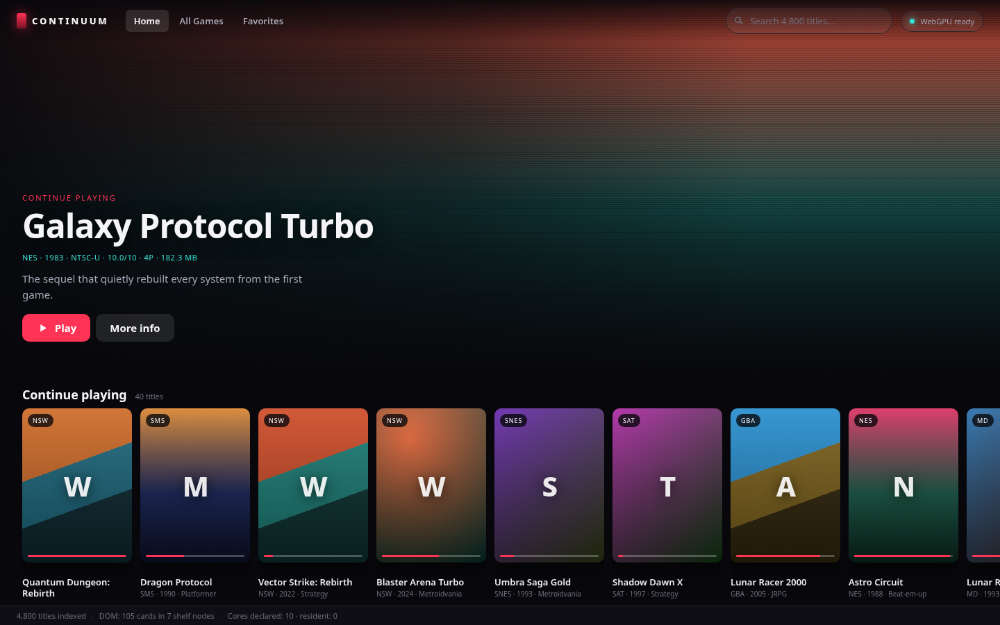
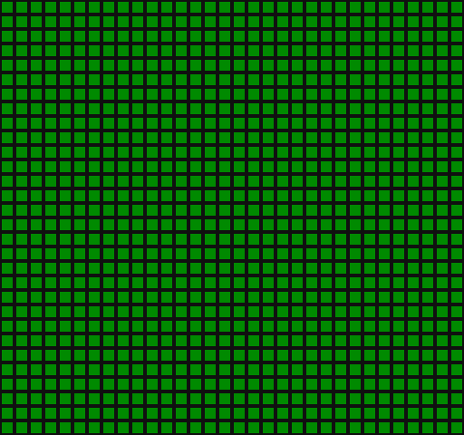
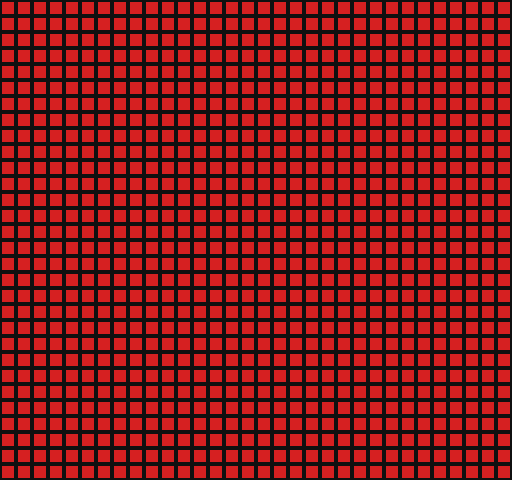
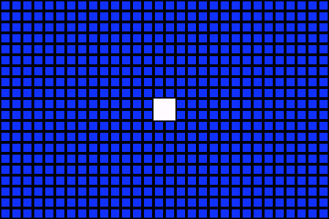
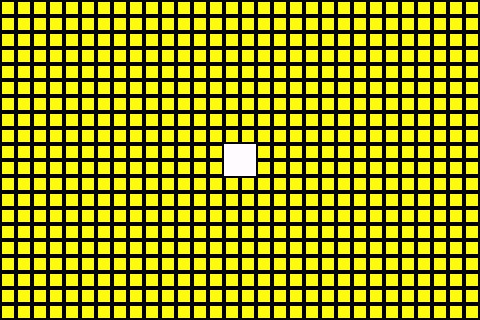
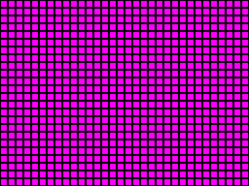
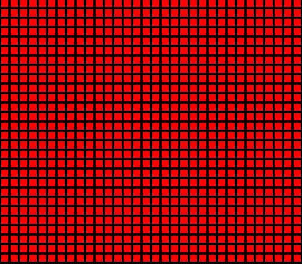

# Continuum — multi-system emulator

A WebGPU emulator front end whose engine is a Rust crate, so that the native iOS phase
(sideloaded, JIT-capable cores) is a UI port rather than a rewrite.

**Four real cores hot-swap cleanly**, three of them written in C and one in C++, all
compiled to standalone WebAssembly, routed by ROM header, and swapped with one core in
memory at a time — verified by the collector, not by bookkeeping. A system can be served
by more than one core, and the user can pick. The Phase 1 scaffold is unchanged
underneath; `v0.1.0-scaffold` marks that restore point.



All four cores, rendering their own test ROMs — idle, and with a button held:

| NES · fceumm | NES · held | GBA · mGBA | GBA · held |
| --- | --- | --- | --- |
|  |  |  |  |

| SMS · Genesis Plus GX | SMS · held | SNES · Snes9x | SNES · held |
| --- | --- | --- | --- |
|  |  |  |  |

Captured from the cores' own framebuffers by `scripts/capture-frames.mjs`, not from a
screenshot: headless Chromium cannot composite a WebGPU canvas (see *Known environment
limitation*), and a blank canvas would misrepresent a working pipeline. The differing
idle colours are deliberate — they let a test identify which core drew a frame.

## What runs today

- **Four real cores**, all built by `scripts/build-core.sh` against wasi-libc as
  standalone wasm modules (no Emscripten, no RetroArch bundle):

  | Core | Systems | Language | Size | Reports |
  | --- | --- | --- | --- | --- |
  | `fceumm` | NES | C | 1.68 MB | 256x240 · 60.0998 Hz · 48000 Hz |
  | `mGBA` | GBA, GB, GBC | C | 1.52 MB | 240x160 · 59.7275 Hz · 65536 Hz |
  | `genesis_plus_gx` | Mega Drive, Master System | C | 2.79 MB | 256x192 · 59.9227 Hz · 44100 Hz |
  | `snes9x` | SNES | **C++** | 3.14 MB | 256x224 · 60.0988 Hz · 32040 Hz |

  Those values — not the manifest's — configure the pacer, renderer and resampler.
- **Dynamic routing and clean swaps.** A `.nes` file gets fceumm, a `.gba` file gets
  mGBA, a `.sms` file gets Genesis Plus GX, a `.sfc` gets Snes9x — decided by header,
  with the extension only as a fallback. Switching systems frees the previous core
  *before* instantiating the next: at no point are two cores alive, and the modules are
  actually reclaimed by the host.
- **Subcores: one system, many cores.** `gb` runs on mGBA or Gambatte; `sms` on Genesis
  Plus GX or SMS Plus GX. The registry ranks candidates by priority and the user can
  override per system — a dropdown in the detail sheet, or right-click / long-press a
  card for "Play with…". A stored preference that no longer applies is ignored in
  favour of the default rather than handing content to a core that cannot run it.
- **Progress that survives.** Save states are persisted to IndexedDB — metadata in one
  store so listing never deserialises payloads, bytes in another. Every state is tagged
  with the core that wrote it and its exact length, and a state is refused rather than
  loaded if any of those has changed: `retro_unserialize` is unversioned and will
  happily accept a foreign blob into a machine that then breaks somewhere unrelated.
  Nobody has to press Save — a game is checkpointed on exit, on backgrounding, and
  every 30 seconds while it runs, and launching restores that checkpoint.
- **Real content.** Import your own ROMs by picker or drag-and-drop; they are
  identified by header, stored in IndexedDB and restored on reload. The library ships
  four ROMs of its own — the *Continuum Test Carts* for NES, GBA, Master System and
  SNES, written from scratch in `scripts/make-{test,gba,sms,snes}-rom.*` — because an
  emulator with an empty library cannot demonstrate anything, and commercial ROMs
  cannot be bundled. Each idles in a different colour, so a captured frame identifies
  which core drew it.
- **Real input.** `GamepadBridge` in Rust owns the mapping: the W3C standard-gamepad
  layout, deadzones, stick-to-D-pad synthesis, and a per-source merge so an idle
  controller cannot cancel a keypress. The front end only forwards events.
- **Everything from Phase 1.** One `requestAnimationFrame` loop, WebGPU-only
  rendering, strictly virtualised lists, and no core fetched before it is needed.
- **A library made only of real content.** Out of the box it holds the four bundled test
  carts and nothing else. Everything after that is a file you imported, stored in
  IndexedDB and restored at every boot — import once, and it is still there after the app
  is closed. Shelves are strictly dynamic: a system with no games contributes no row.
- **Cover art in five tiers.** Box art, then title screen, then in-game shot from the
  libretro archive; then the same three with the dump tags dropped; then a thumbnail
  captured from the game itself once it has run for a second; then an image you choose.
  Anything with none of those gets a generated console-themed plate, so no card is blank.
- **A Settings sheet** with a counted storage breakdown, per-system default cores, and
  toggles for the performance HUD (off on phones), the art lookup, and auto-capture.

**Next: native iOS.** The engine already type-checks and lints clean for
`aarch64-apple-ios`. [docs/NATIVE_IOS_BLUEPRINT.md](docs/NATIVE_IOS_BLUEPRINT.md) is the plan
for wrapping it in a SwiftUI app over a UniFFI boundary;
[docs/SET_HW_RENDER_DESIGN.md](docs/SET_HW_RENDER_DESIGN.md) is the graphics design for
hardware-rendered cores — MoltenVK and ANGLE into a zero-copy `MTLTexture`, dual-screen
mapping for DS and 3DS, and a custom C++ libretro wrapper that brings a standalone ARM64
Switch engine into the same pipeline.

## The five architectural rules, and where they are enforced

| Rule | Enforced by | Verified by |
| --- | --- | --- |
| 1. UI talks to cores only through a Rust `EmulatorBridge` | `crates/emulator-bridge/src/bridge.rs`; the wasm facade in `wasm.rs` is a thin, logic-free wrapper | JS never imports anything but `engine/bridge-host.js` |
| 2. WebGPU only — no 2D canvas, no DOM rendering | `crates/emulator-bridge/src/gfx/renderer.rs` + `frame_blit.wgsl`; wasm builds compile only wgpu's `webgpu` backend, so there is no WebGL2 fallback to fall into | smoke test traps `getContext('2d')` for the whole session |
| 3. One unified `rAF` loop | `web/src/engine/loop.js` — the only `requestAnimationFrame` in the app; it also flushes the UI, after the engine tick | smoke test counts rAF registrations and asserts the loop idles |
| 4. Strict virtualisation, no O(n) DOM | `web/src/ui/virtual-scroller.js`, used four times: shelf list, cards within each shelf, all-games grid, save states | smoke test writes 320 real ROMs to IndexedDB, reloads, then scrolls and asserts node counts do not change |
| 5. No core loaded at boot | `web/src/engine/core-loader.js` declares metadata only; `CoreRegistry::attach_module` / `attach_core` are the only paths to a runnable core | smoke test asserts `residentCoreCount === 0` at boot, `1` after launch |

## Multi-core memory discipline

The failure mode this design exists to prevent: each core is a wasm module with its own
linear memory — 5 MB for fceumm with a ROM loaded, 22 MB for Snes9x, **35 MB for mGBA** — so leaking one
per system switch exhausts a phone in a handful of swaps, and iOS kills processes on
memory pressure rather than paging.

Three mechanisms, and then three independent checks that they work.

**Mechanism.** `CoreRetention::Drop` is the default: ending a session frees its core
rather than keeping it warm. `CoreRegistry::unload_all_except` runs before a launch, so a
switch cannot leave a previous core resident. And `PlayerView.launch` tears down the
running session *before* fetching or instantiating the next core — otherwise launching
game B from inside game A would briefly hold both.

Teardown, in order: audio sink replaced (freeing the ring), input released, GPU
framebuffer texture dropped, save-state scratch freed, then the core itself. Dropping
`WasmCore` runs `retro_unload_game` → `retro_deinit` → frees the core's own allocations →
releases the last handle to its module. On the JS side `LibretroRuntime.destroy()` nulls
every cached typed-array view, because a single retained `Uint8Array` pins the whole
`ArrayBuffer` and therefore the whole core.

**Proof.** Bookkeeping alone would not be convincing, so `smoke-test.mjs` cycles
NES → GBA → Master System three times, switches game-to-game without returning to the
library, switches core for a single system, and then asserts:

| Question | How it is answered |
| --- | --- |
| Was every runtime torn down? | `instantiated === destroyed`, zero live |
| Were the modules *actually freed*? | `FinalizationRegistry` after a forced GC — the collector attests, not us |
| Were two ever alive at once? | `maxLive` high-water mark, which a post-hoc check would miss |
| Did the engine's own memory grow? | Rust wasm memory before vs after twelve sessions |

Current numbers: 16 runtimes instantiated, 16 destroyed, **16/16 collected**, high-water
mark 1, peak 35.4 MB, engine memory 4.6 MB → 4.6 MB across twelve sessions of
NES → GBA → Master System → SNES. Wasm memory never shrinks, so the test is that growth
*stops*; it does. The status bar shows the same figures live — browsing the library reads
`0 resident · 0.0 MB live`.

## How a libretro core is embedded

The hard part is not compiling C to wasm — it is that a libretro core calls the
frontend through function *pointers* it was handed, and **a host cannot manufacture a
function pointer inside another wasm module.** A JS frontend has nothing valid to pass
to `retro_set_video_refresh`.

So `core-shim/libretro_wasm_shim.c` is compiled *into* the core module. Its functions
are real, in-table function pointers as far as the core is concerned, and each one
forwards to an imported host function:

```
core (C) ──calls fn ptr──▶ shim trampoline ──wasm import──▶ JS runtime ──▶ Rust
```

One frame, in full:

```
bridge.tick(now)                                   Rust
  └─ WasmCore::run_frame(input)                     Rust: publishes staging + input
       └─ runtime.run()                             JS
            └─ retro_run()                          core, its own wasm memory
                 ├─ host.input_state  ─────────────▶ CoreHost::inputState   (Rust)
                 ├─ host.video_refresh ────────────▶ copy → Rust staging, videoReady
                 └─ host.audio_batch  ────────────▶ copy → Rust staging, audioReady
       └─ host::end_frame()                         Rust: geometry + audio counts
  └─ renderer.present(frame)                        Rust: wgpu upload + blit
```

Notes on the seams that were not obvious going in:

- **The core's memory is separate**, so exactly one copy per frame is unavoidable.
  120 KB/frame for NES RGB565 (~7 MB/s) is nothing next to the GPU upload that follows.
- **Callbacks re-enter Rust mid-tick**, while `EmulatorBridge` is already mutably
  borrowed. `CoreHost`'s methods are therefore *static* and talk to a thread-local
  frame exchange — an instance method would panic on the second `RefCell` borrow.
- **Modern cores need more than bytes.** fceumm declares `need_fullpath = true`
  globally, then overrides it per extension via `SET_CONTENT_INFO_OVERRIDE` and
  discovers the content through `GET_GAME_INFO_EXT`. Both are implemented; without them
  a valid `.nes` file is rejected.
- **WASI imports are few and stubbed.** fceumm needs 12 (all file syscalls); Genesis
  Plus GX and Snes9x 14; mGBA 19, adding clocks, `environ` and directory calls.
  `clock_time_get` returns real time because mGBA drives the GBA's RTC from it; the rest
  fail cleanly, since the core is never given a path to open.
- **C++ cores link, but without exceptions.** wasi-sdk 25 ships `libc++` and
  `libc++abi`, and the STL works — but the unwinder runtime is absent, so
  `__cxa_throw`, `__cxa_begin_catch` and `_Unwind_CallPersonality` are undefined at
  link, and `-fwasm-exceptions` does not help. Everything is therefore compiled
  `-fno-exceptions -fno-rtti`, which costs nothing: emulator cores target consoles where
  exceptions are equally unavailable, and snes9x's own makefile already passes both
  flags. A core with any C++ is linked by `clang++` rather than `clang`, because that is
  what pulls the C++ runtime in.
- **Some cores identify their system from the filename.** Genesis Plus GX emulates four
  machines and picks between them by reading the last three characters of
  `retro_game_info_ext.full_path`. Passing NULL there — reasonable, since browser
  content has no path — made a Master System cart boot as a Mega Drive, running Z80
  bytes on the 68000. The runtime now supplies a synthetic bare filename.
- **Cores need different build strategies.** fceumm, Genesis Plus GX and Snes9x expose
  libretro makefiles listing their sources — `SOURCES_C` and, for Snes9x, `SOURCES_CXX`
  too, so each file is compiled by the driver for its own language. mGBA is CMake-based,
  so `build-core.sh` configures it with wasi-sdk's toolchain file and links the resulting
  static archive. Adding a core is a case block in that script — nothing in Rust changes,
  because `WasmCore` is core-agnostic. Genesis Plus GX additionally needs wasm
  `setjmp`/`longjmp` for the Musashi 68000's address-error traps;
  `SESSION_HANDOFF.md` lists the rest of the per-core flags and why each is there.

## Layout

```
core-shim/                      C shim compiled into every core (callback trampolines)
crates/emulator-bridge/         Rust engine. Compiles to wasm32 (Phase 1) and
  src/bridge.rs                 native ARM64 (Phase 2) from the same source.
  src/wasm.rs                   wasm-bindgen facade (wasm32 only)
  src/cores/wasm_core.rs        EmulatorCore over a real libretro module
  src/cores/host.rs             CoreHost: the callbacks a running core re-enters
  src/cores/{mod,registry,diagnostic}.rs   trait, lazy registry, stand-in core
  src/gfx/                      wgpu renderer, WGSL blit, pixel-format conversion
  src/audio/                    AudioSink, ring buffer, resampler
  src/input/gamepad.rs          GamepadBridge: layouts, deadzones, source merge
  src/{timing,frame}.rs         frame pacing, geometry
web/
  index.html  styles/           dark Netflix-style shell
  src/ui/virtual-scroller.js    the virtualisation primitive
  src/ui/{library,player}-view.js, detail-sheet.js, card.js, art.js
  src/ui/core-menu.js           "Play with…" subcore picker (right-click / long-press)
  src/engine/core-runtime.js    instantiates a libretro core; environment protocol
  src/engine/{loop,bridge-host,core-loader,input}.js
  src/audio/{audio-output,pcm-worklet}.js
  src/ui/rom-import.js          file picker, drag-and-drop, library plumbing
  src/data/idb.js               the one IndexedDB connection and the whole schema
  src/data/save-states.js       state index in memory, payloads on disk
  src/ui/settings-sheet.js      storage breakdown, default cores, interface toggles
  src/data/artwork.js           the five cover-art tiers and object-URL ownership
  src/data/boxart.js            libretro thumbnail lookup: naming rules, fallbacks
  src/data/png.js               PNG encoder with no canvas, for captured thumbnails
  src/data/settings.js          user settings, localStorage-backed
  src/data/                     library index, systems, ROM store/detect, core prefs
  cores/manifest.json           core declarations (metadata only)
  roms/nes-testcart.nes         our own NES ROM, generated by make-test-rom.py
  roms/gba-testcart.gba         our own GBA ROM, built from roms/src/ by make-gba-rom.sh
  roms/sms-testcart.sms         our own Master System ROM, from make-sms-rom.py
  roms/snes-testcart.sfc        our own SNES ROM, from make-snes-rom.py
  roms/src/                     GBA cart source: C, entry stub, linker script
  vendor/bridge/                build output of scripts/build-wasm.sh (gitignored)
scripts/
  build-wasm.sh                 cargo build + wasm-bindgen
  build-core.sh                 libretro core → standalone wasm (wasi-sdk);
                                fceumm, mgba, genesis_plus_gx
  make-test-rom.py              6502 assembler + NES test ROM generator
  make-gba-rom.sh               ARM/C → GBA test ROM, header and checksum patched
  make-sms-rom.py               Z80 assembler + Master System test ROM generator
  make-snes-rom.py              65816 + SPC700 assemblers, SNES test ROM generator
  core-abi-test.mjs             headless core/ABI verification (no browser, no GPU)
  capture-frames.mjs            PNGs of each core's output, straight from its framebuffer
  serve.mjs                     static server with correct wasm/ESM MIME types
  smoke-test.mjs                headless browser verification of the rules above
```

## Build and run

```bash
rustup target add wasm32-unknown-unknown
cargo install wasm-bindgen-cli --version 0.2.128   # must match the Cargo.lock version

./scripts/build-wasm.sh          # engine → web/vendor/bridge/
./scripts/build-core.sh all      # all four cores → web/cores/ (fetches wasi-sdk, ~1 GB)
python3 scripts/make-test-rom.py # NES test ROM → web/roms/nes-testcart.nes
./scripts/make-gba-rom.sh        # GBA test ROM → web/roms/gba-testcart.gba
python3 scripts/make-sms-rom.py  # SMS test ROM → web/roms/sms-testcart.sms
python3 scripts/make-snes-rom.py # SNES test ROM → web/roms/snes-testcart.sfc
node scripts/serve.mjs 8123      # → http://localhost:8123/
```

Then open the library and press **Play** on any *Continuum Test Cart* — the NES one
idles green, the GBA one blue, the Master System one magenta, the SNES one white — or
drop your own `.nes`, `.sfc`, `.smc`, `.gba`, `.gb`, `.gbc`, `.sms`, `.gg`, `.md` or
`.gen` file anywhere on the page. Systems without a real core yet (N64, PS1, Saturn) fall
back to the placeholder core; a launch that needs an unbuilt core says which script to
run.

Right-click (or long-press) a card whose system has more than one core to launch it on
the alternative; the same choice is available as a dropdown in the detail sheet.

Needs a WebGPU browser: Chrome/Edge 113+, Safari 18+, Firefox 141+. There is
deliberately no fallback renderer; without WebGPU the UI says so and refuses to
launch.

**Controls.** Arrows = D-pad, `Z`/`X` = B/A, `A`/`S` = Y/X, `Q`/`W` = L/R,
`Enter` = Start, `Shift` = Select, `P` = pause, `Esc` = back.

Controllers are picked up automatically and assigned to the first free port; the HUD
shows how many are connected. On touch devices the on-screen pad appears, and its
D-pad is tracked as one surface so diagonals actually work. All three sources can be
used at once — they are merged in Rust, not fought over.

## Verification

Three layers, fastest first.

```bash
cargo test                                  # 70 unit tests: pacing, ring buffer,
                                            # resampler, registry + subcore resolution,
                                            # gamepad mapping, pixel conversion, scaling
node scripts/core-abi-test.mjs              # 64 checks across all four cores, headless
node scripts/serve.mjs 8123 &
PLAYWRIGHT_CORE=<path> node scripts/smoke-test.mjs http://localhost:8123/   # 95 checks
```

**`core-abi-test.mjs`** runs each core with its own test ROM in plain Node — no browser,
no GPU, no Rust — and asserts on what actually came out. Per core:

- geometry, refresh and sample rate as the core reports them, and the pixel format it
  negotiated through the environment protocol;
- audio frames per video frame matching `sampleRate / fps`, with a non-zero peak — the
  ROM's 440 Hz tone surviving the batch callback;
- the idle frame is the expected colour *and* contains both dark and bright pixels, so a
  flat fill cannot pass;
- holding a button changes the colour and releasing restores it: input reaching the CPU
  and changing the picture;
- a held direction moves the picture, proving per-frame register writes land;
- save state diverges then restores.

The four ROMs idle in **different colours on purpose** — NES green, GBA blue, Master
System magenta, SNES white — so a frame identifies which core drew it. That is what
makes the hot-swap checks meaningful instead of a matter of trusting counters.

The SNES cart is the one that took real work: the SNES has no way for the main CPU to
reach its DSP registers, so the cartridge has to upload a second program to the sound
chip through the APU boot ROM and jump to it. That handshake is a lockstep mailbox where
every byte is acknowledged, so a wrong constant hangs rather than misbehaving — which is
why each stage records its progress in a work-RAM byte the test can read back.

`scripts/capture-frames.mjs` writes the images above from the same bytes the renderer
uploads, which is the honest way to show emulated output from a machine whose GPU stack
cannot present a canvas.

**`smoke-test.mjs`** covers the browser path: every Phase 1 invariant (node counts,
single loop, no 2D context, lazy cores), offscreen GPU pixel verification, the real NES
core end to end, the multi-core swap and leak checks described above, the subcore path
— candidate ranking, a preference selecting an alternative core, a stale preference
being ignored, the picker appearing only where there is a choice, and the same ROM
actually running on a different core when overridden — and save-state persistence.

That last one is worth describing, because the easy version of the test proves nothing.
It writes a state, discards the in-memory index entirely, rehydrates it from IndexedDB
through the same path boot uses, and only then inspects the records. It then pauses the
core, loads the payload that has been through disk, and re-serialises: **zero of 13,758
bytes differ.** The compatibility gate is checked from all four directions — its own
core accepted, a different core, a different version and a different length each
refused.

One thing it deliberately does *not* claim: that resume-on-launch can be distinguished
from a fresh boot by comparing state bytes. On a cart as simple as the NES test ROM, a
fresh boot and an 84-frame-old checkpoint differ by about 46 bytes out of 13,758, so no
byte comparison could tell them apart. The test asserts what is actually observable —
that the resume path ran and the session kept running — and leaves the fidelity claim
to the byte-exact check above, which earns it.

### Known environment limitation

In headless Chromium on SwiftShader, touching a WebGPU canvas swapchain destroys the
device (`getCurrentTexture` → `device.lost: destroyed`), after which every GPU call
silently no-ops and the canvas reads back empty. Reproduced with hand-written JS
independent of this codebase, so it is not a bug here — but it is why the browser suite
verifies pixels through `captureFrame` (an offscreen render plus buffer readback) and
reports canvas compositing as an observation rather than a failure. It is also why the
cores' *emulated* pixels are asserted in the Node harness instead. On real hardware the
same pipeline presents to the canvas.

## What's next

`SESSION_HANDOFF.md` is the full architectural brief — the reasoning behind each
subsystem, the traps already paid for, and the list of things not to undo. The short
version of what remains:

- **More cores.** Mupen64Plus, Beetle PSX and Yabause are still placeholders, as is
  Gambatte (declared as the alternative for GB/GBC to exercise the subcore path). Each is
  a case block in `scripts/build-core.sh` plus a manifest line; `WasmCore` is
  core-agnostic, so no Rust changes. Both C and C++ are supported now, so promoting
  Gambatte to a real core is mostly a matter of its flags. N64 and PS1 are a different
  proposition — they want dynamic recompilation and a hardware renderer.
- **A Mega Drive test cart.** Genesis Plus GX is verified in Master System mode only. A
  68000 cart would cover the other half of the core and the extension-driven system
  switch in both directions.
- **Core options.** `GET_VARIABLE` returns "unset", so every core runs on defaults.
  Wiring `SET_VARIABLES` to a settings UI unlocks region, overscan, palette and — for
  mGBA — frameskip, colour correction and GB model.
- **Save-state UI.** Persistence is done, but there is no way to browse states across
  games, export one, or see how much storage they use — only the per-game list in the
  detail sheet.
- **Audio quality.** The resampler is linear; a windowed-sinc belongs there before
  anyone judges the sound.
- **Rewind and fast-forward.** The pacer already supports a speed multiplier. NES states
  are 13 KB, SNES 823 KB, GBA 516 KB, Genesis 1 MB — a rewind ring needs a memory budget
  and probably compression, not just a deeper buffer.

## Next: native iOS

**Audited, and the answer is yes.** `cargo check --target aarch64-apple-ios` and
`--target aarch64-apple-darwin` are both clean, as is `cargo clippy --all-targets`
against them — so the 70 unit tests type-check for the device too. `bridge.rs` mentions
`wasm_bindgen` exactly once, in a doc comment claiming it does not use it; that claim is
now compiler-checked.

**4,896 of 6,308 lines — 77% — compile unchanged for iOS.** The web-only 23% is exactly
the platform boundary: the `wasm.rs` facade (769 lines), the core loader
(`cores/wasm_core.rs`, 380), the callback bridge (`cores/host.rs`, 263) and one
canvas-specific constructor in the renderer. Nothing else is gated.

Two properties are doing the work, and neither should be given up: the engine never
reads a clock (`FramePacer::plan()` takes a timestamp, so there is no platform shim to
write), and the unit tests already run in the `not(target_arch = "wasm32")`
configuration — the same one iOS uses — so every `cargo test` is a regression test for
the native build.

One concrete gap: `crate-type` needs `staticlib` added to link into a Swift app. It is
left undone on purpose, because `cargo check` does not link and so the change would be
unverifiable from here. See `SESSION_HANDOFF.md` §9.


The engine is already interface-agnostic: `bridge.rs` has no `wasm_bindgen`, no
`web_sys`, no JS types, and the renderer's `from_surface` takes any wgpu surface —
a `CAMetalLayer` works where a canvas does today. The native build adds a UniFFI facade
beside `wasm.rs` (same methods, same error type) and a SwiftUI front end that makes the
same calls this JS does.

One thing that will differ: cores are instantiated by the platform layer, because only
JS can wire up another wasm module's imports. Natively they are `dlopen`'d or statically
linked instead, so `LibretroRuntimeHandle` gains a second implementation — while
`WasmCore`'s logic, the frame exchange in `cores/host.rs` and everything above the
`EmulatorCore` trait stay as they are. What it must *not* do is reimplement pacing, input
mapping, audio buffering or session lifecycle — those live in Rust precisely so the
two platforms cannot drift.
